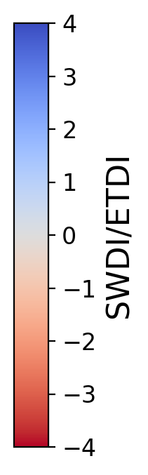

# G4GRASS
This Github is dedicated for GRASS - FNR-BRIDGE Project on drought in Luxembourg and the Greater Region

**Context:**
Climate change is increasing the frequency and severity of hydrological extremes in many parts of the world. In Europe as well as in Luxembourg, droughts have worsened in intensity and duration in recent years, causing significant loss to several sectors, such as agriculture and forestry. There is a pressing need for developing and setting up advanced drought monitoring and prediction systems. In this context, GRASS aims to improve drought prediction accuracy by jointly assimilating, into a distributed hydrological model SUPERFLEX, various EO-based datasets, namely soil moisture (SM) and total water storage (TWS) derived from SMAP/AMSR-2/S-1 and GRACE \& GRACE-FO satellite missions respectively. The assimilation of satellite-observed water content enables an integrated assessment and modeling of water resources through the monitoring and modeling of SM and groundwater availability in Luxembourg and the Greater Region, between 2011 and 2022.

**Keywords:** 
Drought, Soil Moisture, Total Water Storage, Data assimilation, SUPERFLEX, Sentinel-1, GRACE

**Acknowledgment:**
This work is supported by the Luxembourg National Research Fund (FNR) through the GRASS project (grant no. BRIDGES2021/SR/15824592).

## A. Evapotranspiration Deficit Index (ETDI) and Soil Water Deficit Index (SWDI)

     
    <em>Figure 1: ETDI over Luxembourg and the Greater Region based on PET and open-loop SUPERFLEX-simulated actual ET (AET). It computes the weekly ET deficit according to its min, max and median values over the same week every year during 11-year period of SUPERFLEX outputs.</em>

     
    <em>Figure 2: WSDI over Luxembourg and the Greater Region based on open-loop SUPERFLEX-simulated total water storage. It computes the weekly soil water deficit according to its mean and standard deviation over the same week every year during 11-year period of SUPERFLEX outputs.</em>

## B. Standardized Soil moisture Index (SSI)

     
    <em>Figure 3: SSI over Luxembourg and the Greater Region based on open-loop SUPERFLEX-simulated soil moisture (SM). It computes the SM anomalies for each calendar day (here only show one day per week) according to its mean and standard deviation over the same month every year during 11-year period of SUPERFLEX outputs.</em>

## C. Low-Flow Index (SSI)

     
    <em>Figure 4: LFI over Luxembourg based on open-loop SUPERFLEX-simulated discharge. It computes the low-flow hazard level for each calendar day (here only show days with significant hazards), by comparing the current discharge and the 95th-percentile exceedence value of Flow Duration Curve (computed with a 31-day moving window for a 11-year period of SUPERFLEX outputs).</em>

Note: Why only Luxembourg? I can only get the river shapefile for Luxembourg for now.

## D. Summary of Drought Indices

<table border=0 cellpadding=0 cellspacing=0 width=2099 style='border-collapse:
 collapse;table-layout:fixed;width:1576pt;mso-yfti-tbllook:1056'>
 <col width=234 style='mso-width-source:userset;mso-width-alt:8557;width:176pt'>
 <col width=303 style='mso-width-source:userset;mso-width-alt:11081;width:227pt'>
 <col width=130 style='mso-width-source:userset;mso-width-alt:4754;width:98pt'>
 <col width=193 style='mso-width-source:userset;mso-width-alt:7058;width:145pt'>
 <col width=129 style='mso-width-source:userset;mso-width-alt:4717;width:97pt'>
 <col width=1110 style='mso-width-source:userset;mso-width-alt:40594;
 width:833pt'>
 <tr height=20 style='height:15.0pt'>
  <td height=20 class=xl65 width=234 style='height:15.0pt;width:176pt'>class</td>
  <td class=xl65 width=303 style='width:227pt'>Index</td>
  <td class=xl65 width=130 style='width:98pt'>Input</td>
  <td class=xl65 width=193 style='width:145pt'>Spatial availability</td>
  <td class=xl65 width=129 style='width:97pt'>Time</td>
  <td class=xl65 width=1110 style='width:833pt'>Reference</td>
 </tr>
 <tr height=22 style='height:16.5pt'>
  <td rowspan=3 height=66 class=xl69 style='height:49.5pt'>Meteorological
  droughts</td>
  <td>SPI (1, 3, 6, 9, 12, 24)</td>
  <td>P</td>
  <td>0.25o x 0.25o (ERA5)</td>
  <td>1, 3, 6, 9, 12, 24 months</td>
  <td class=xl70>LLoyd-Hughes, B. and Saunders, M.A.: A drought climatology for
  Europe. International Journal of Climatology, 22, 1571-1592, 2002.</td>
 </tr>
 <tr height=22 style='height:16.5pt'>
  <td height=22 style='height:16.5pt'>SPEI (1, 3, 6, 9, 12, 24)</td>
  <td>P, PET</td>
  <td>0.25o x 0.25o (ERA5)</td>
  <td>1, 3, 6, 9, 12, 24 months</td>
  <td class=xl70>Vicente-Serrano S.M., Beguería S., López-Moreno J.I.: A
  Multi-scalar drought index sensitive to global warming: The Standardized
  Precipitation Evapotranspiration Index. Journal of Climate, 23, 1696-1718,
  2010.</td>
 </tr>
 <tr height=22 style='height:16.5pt'>
  <td height=22 style='height:16.5pt'>SSFI (1, 3, 6, 9, 12, 24)</td>
  <td>P</td>
  <td>0.25o x 0.25o (ERA5)</td>
  <td>1, 3, 6, 9, 12, 24 months</td>
  <td class=xl70>Tijdeman, E., Stahl, K., &amp; Tallaksen, L. M.: Drought
  characteristics derived based on the Standardized Streamflow Index: A large
  sample comparison for parametric and nonparametric methods. Water Resources
  Research, 56, 2020.</td>
 </tr>
 <tr height=20 style='height:15.0pt'>
  <td height=20 style='height:15.0pt'>Groundwater</td>
  <td>SGI - Standardized Groundwater Index</td>
  <td>Groundwater heads</td>
  <td>In-situ GW stations</td>
  <td>Hourly</td>
  <td class=xl70>Bloomfield, J. P. and Marchant, B. P.: Analysis of groundwater
  drought building on the standardised precipitation index approach. Hydrol.
  Earth Syst. Sci., 17, 4769–4787, 2013.</td>
 </tr>
 <tr height=20 style='height:15.0pt'>
  <td rowspan=4 height=80 class=xl69 style='height:60.0pt'>Soil moisture /
  Agricultural droughts</td>
  <td>ETDI (weekly) - Evapotranspiration Deficit Index</td>
  <td>PET, AET</td>
  <td>Cell 1km x 1km</td>
  <td>Weekly</td>
  <td rowspan=2 class=xl71>Narasimhan, B., and R. Srinivasan. &quot;Development
  and evaluation of Soil Moisture Deficit Index (SMDI) and Evapotranspiration
  Deficit Index (ETDI) for agricultural drought monitoring.&quot; Agricultural
  and forest meteorology 133, no. 1-4 (2005): 69-88.</td>
 </tr>
 <tr height=20 style='height:15.0pt'>
  <td height=20 style='height:15.0pt'>SWDI (weekly, 1m) - Soil Water Deficit
  Index</td>
  <td>Water content (S)</td>
  <td>Cell 1km x 1km</td>
  <td>Weekly</td>
 </tr>
 <tr height=20 style='height:15.0pt'>
  <td rowspan=2 height=40 class=xl69 style='height:30.0pt'>SSI - Standardized
  Soil moisture Index</td>
  <td>Soil moisture (&#952;)</td>
  <td>In-situ SM stations</td>
  <td>Hourly</td>
  <td rowspan=2 class=xl71>AghaKouchak, A. &quot;A baseline probabilistic
  drought forecasting framework using standardized soil moisture index:
  application to the 2012 United States drought.&quot; Hydrology and Earth
  System Sciences 18, no. 7 (2014): 2485-2492.</td>
 </tr>
 <tr height=20 style='height:15.0pt'>
  <td height=20 style='height:15.0pt'>Soil moisture (&#952;)</td>
  <td>Cell 1km x 1km</td>
  <td>Daily</td>
 </tr>
 <tr height=20 style='height:15.0pt'>
  <td rowspan=2 height=40 class=xl69 style='height:30.0pt'>Hydrological
  droughts</td>
  <td rowspan=2 class=xl69>LFI (Q95, 10 days) - Low-Flow Index</td>
  <td rowspan=2 class=xl69>Discharge (Q)</td>
  <td>In-situ Q stations</td>
  <td>Monthly</td>
  <td rowspan=2 class=xl71>Cammalleri, Carmelo, Jürgen Vogt, and Peter Salamon.
  &quot;Development of an operational low-flow index for hydrological drought
  monitoring over Europe.&quot; Hydrological Sciences Journal 62, no. 3 (2017):
  346-358.</td>
 </tr>
 <tr height=20 style='height:15.0pt'>
  <td height=20 style='height:15.0pt'>Cell 1km x 1km</td>
  <td>Monthly</td>
 </tr>
 <![if supportMisalignedColumns]>
 <![endif]>
</table>

The Figure below summarizes all these drought indices at Weierbach, the most instrumented and studied sub-catchment in the Alzette River basin in Luxembourg, where multiple ground stations have been maintained by LIST.

     
    <em>Figure 5: Drought Indices at Weierbach. 1st panel: ERA-5 precipitation (blue) and potential evapotranspiration (green). 2nd-4th panel: SPI-3, SPEI-3, SSFI-3. 5th panel: SGI (based on WEI-GW3 station). 6th -7th panel: ETDI and SWDI (based on model output actual ET and total water storage, respectively). 8th-10th: SSI based on observed SM, open-loop simulated SM, and reanalysis SM. 11th-13th: LFI based on observed discharge, open-loop simulated discharge, and reanalysis discharge. </em>

    
    
 
    <em>Figure 6: Drought Indices on 2018-08-02. 1st panel: ERA-5 precipitation (blue) and potential evapotranspiration (green). 2nd-4th panel: SPI-3, SPEI-3, SSFI-3. 5th panel: SGI (based on WEI-GW3 station). 6th -7th panel: ETDI and SWDI (based on model output actual ET and total water storage, respectively). 8th-10th: SSI based on observed SM, open-loop simulated SM, and reanalysis SM. 11th-13th: LFI based on observed discharge, open-loop simulated discharge, and reanalysis discharge. </em>

<!-- 

-->

## D. Presentation of the hydrologic SUPERFLEX model and Data Assimilation

### D.1. SUPERFLEX model version history

<table border=0 cellpadding=0 cellspacing=0 width=1193 style='border-collapse:
 collapse;table-layout:fixed;width:895pt;mso-yfti-tbllook:1056'>
 <col width=235 style='mso-width-source:userset;mso-width-alt:8594;width:176pt'>
 <col width=200 style='mso-width-source:userset;mso-width-alt:4681;width:96pt'>
 <col width=257 style='mso-width-source:userset;mso-width-alt:9398;width:193pt'>
 <col width=157 style='mso-width-source:userset;mso-width-alt:5741;width:118pt'>
 <col width=416 style='mso-width-source:userset;mso-width-alt:15213;width:312pt'>
 <tr height=20 style='height:15.0pt'>
  <td height=20 width=235 style='height:15.0pt;width:176pt'></td>
  <td width=200 style='width:96pt'>Model extent</td>
  <td width=257 style='width:193pt'>Resolution / Timestep</td>
  <td width=157 style='width:118pt'>Number of parameters</td>
  <td width=416 style='width:312pt'>Notes</td>
 </tr>
 <tr height=20 style='height:15.0pt'>
  <td height=20 style='height:15.0pt'>GRASS-CRAKE</td>
  <td>Greater Region</td>
  <td>1km / Hourly</td>
  <td>8</td>
  <td rowspan=3 class=xl66 width=416 style='width:312pt'>- ERA5 P and PET 
    - 5 land-use classes, 2 geology classes 
    - 4 reservoirs (2 UR, 1 FR, 1 SR) 
    - S1max = 5cm, S2max = 95 cm (fixed) 
    - Calibration over discharge (4 stations) and S1 SM data
 
 </td>
 </tr>
 <tr height=20 style='height:15.0pt'>
  <td height=20 style='height:15.0pt'>GRASS</td>
  <td>Greater Region</td>
  <td rowspan=3 class=xl65>1km / Daily (timelag functions not used)</td>
  <td>9 (added Field capacity)</td>
 </tr>
 <tr height=20 style='height:15.0pt'>
  <td height=20 style='height:15.0pt'>GRASS (currently used for testing DA)</td>
  <td>Alzette sub-catchment</td>
  <td>9</td>
 </tr>
 <tr height=20 style='height:15.0pt'>
  <td height=20 style='height:15.0pt'>GRASS updated (TBD)</td>
  <td>Greater Region</td>
  <td>9</td>
  <td>Updating equations… + recalibration</td>
 </tr>
 <![if supportMisalignedColumns]>
 <![endif]>
</table>

### D.2. DA development version history

<table border=0 cellpadding=0 cellspacing=0 width=1159 style='border-collapse:
 collapse;table-layout:fixed;width:869pt;mso-yfti-tbllook:1056'>
 <col width=235 style='mso-width-source:userset;mso-width-alt:8594;width:176pt'>
 <col width=128 style='mso-width-source:userset;mso-width-alt:4681;width:96pt'>
 <col width=200 style='mso-width-source:userset;mso-width-alt:9398;width:193pt'>
 <col width=300 style='mso-width-source:userset;mso-width-alt:10971;width:225pt'>
 <col width=239 style='mso-width-source:userset;mso-width-alt:8740;width:179pt'>
 <tr height=20 style='height:15.0pt'>
  <td height=20 style='height:15.0pt'></td>
  <td class=xl68>Assimilation time</td>
  <td class=xl68>Observations</td>
  <td class=xl68>Control vector</td>
  <td class=xl68>Perturbation</td>
 </tr>
 <tr height=40 style='height:30.0pt'>
  <td height=40 style='height:30.0pt'>DA (first iteration)</td>
  <td>Monthly</td>
  <td>Q (in-situ)</td>
  <td>5 state variables</td>
  <td class=xl66 width=239 style='width:179pt'>- Gaussian, additive for P and PET.  
    - 10 members</td>
 </tr>
 <tr height=40 style='height:30.0pt'>
  <td height=40 style='height:30.0pt'>DA (Nth iteration)</td>
  <td>Daily</td>
  <td class=xl66 width=257 style='width:193pt'>Q (in-situ) 
    SM (in-situ)</td>
  <td>5 state variables at all cells from the sub-catchment</td>
  <td rowspan=3 class=xl67 width=239 style='width:179pt'>- Log-normal,
  multiplicative for P 
    - Gaussian, additive for PET 
    - 10-50 members</td>
 </tr>
 <tr height=40 style='height:30.0pt'>
  <td height=40 style='height:30.0pt'>DA (Nth iteration)</td>
  <td>Daily</td>
  <td class=xl66 width=257 style='width:193pt'>Q (in-situ) 
    SM (in-situ)</td>
  <td>5 state variables + 1 parameter (&#961;)</td>
 </tr>
 <tr height=40 style='height:30.0pt'>
  <td height=40 style='height:30.0pt'>DA (last iteration)</td>
  <td>Daily</td>
  <td class=xl66 width=257 style='width:193pt'>SM (satellite) 
    GRACE</td>
  <td>5 state variables at all cells from the sub-catchment</td>
 </tr>
 <![if supportMisalignedColumns]>
 <![endif]>
</table>

## E. Data Assimilation assessments

<table border=0 cellpadding=0 cellspacing=0 width=789 style='border-collapse:
 collapse;table-layout:fixed;width:593pt'>
 <col width=64 style='width:48pt'>
 <col width=145 span=5 style='mso-width-source:userset;mso-width-alt:5302;
 width:109pt'>
 <tr height=20 style='height:15.0pt'>
  <td height=20 class=xl67 width=64 style='height:15.0pt;width:48pt'></td>
  <td class=xl67 width=145 style='width:109pt'></td>
  <td colspan=4 class=xl67 width=580 style='width:436pt'>Validation
  observations</td>
 </tr>
 <tr height=40 style='mso-height-source:userset;height:30.0pt'>
  <td height=40 style='height:30.0pt'></td>
  <td class=xl73></td>
  <td class=xl74 width=145 style='width:109pt'>In-situ discharge at Ettelbruck</td>
  <td class=xl74 width=145 style='width:109pt'>In-situ SM at Weierbach</td>
  <td class=xl74 width=145 style='width:109pt'>In-situ SM at Schifflange</td>
  <td class=xl74 width=145 style='width:109pt'>SMAP SM</td>
 </tr>
 <tr height=40 style='height:30.0pt'>
  <td rowspan=4 height=159 class=xl77 width=64 style='height:119.25pt;
  width:48pt'>Assimilated observations</td>
  <td class=xl74 width=145 style='width:109pt'>In-situ discharge at Ettelbruck</td>
  <td class=xl75 width=145 style='width:109pt'>0.6414</td>
  <td class=xl76 width=145 style='width:109pt'>0.7674</td>
  <td class=xl76 width=145 style='width:109pt'>0.7296</td>
  <td class=xl76 width=145 style='width:109pt'>0.6942</td>
 </tr>
 <tr height=40 style='height:30.0pt'>
  <td height=40 class=xl74 width=145 style='height:30.0pt;width:109pt'>In-situ
  SM at Weierbach</td>
  <td class=xl76 width=145 style='width:109pt'>0.6414</td>
  <td class=xl75 width=145 style='width:109pt'>0.9141</td>
  <td class=xl76 width=145 style='width:109pt'>0.7296</td>
  <td class=xl76 width=145 style='width:109pt'>0.5215</td>
 </tr>
 <tr height=40 style='height:30.0pt'>
  <td height=40 class=xl74 width=145 style='height:30.0pt;width:109pt'>In-situ
  SM at Schifflange</td>
  <td class=xl76 width=145 style='width:109pt'>0.4817</td>
  <td class=xl76 width=145 style='width:109pt'>0.7674</td>
  <td class=xl75 width=145 style='width:109pt'>0.7509</td>
  <td class=xl76 width=145 style='width:109pt'>0.6634</td>
 </tr>
 <tr height=39 style='mso-height-source:userset;height:29.25pt'>
  <td height=39 class=xl74 width=145 style='height:29.25pt;width:109pt'>SMAP SM</td>
  <td class=xl76 width=145 style='width:109pt'>0.4175</td>
  <td class=xl76 width=145 style='width:109pt'>0.6237</td>
  <td class=xl76 width=145 style='width:109pt'>0.7193</td>
  <td class=xl75 width=145 style='width:109pt'>0.7441</td>
 </tr>
 <tr height=20 style='height:15.0pt'>
  <td height=20 class=xl67 style='height:15.0pt'></td>
  <td class=xl73></td>
  <td class=xl76 width=145 style='width:109pt'></td>
  <td class=xl76 width=145 style='width:109pt'></td>
  <td class=xl76 width=145 style='width:109pt'></td>
  <td class=xl76 width=145 style='width:109pt'></td>
 </tr>
 <tr height=20 style='height:15.0pt'>
  <td height=20 class=xl67 style='height:15.0pt'></td>
  <td class=xl74 width=145 style='width:109pt'>OL</td>
  <td class=xl76 width=145 style='width:109pt'>0.5368</td>
  <td class=xl76 width=145 style='width:109pt'>0.7256</td>
  <td class=xl76 width=145 style='width:109pt'>0.6962</td>
  <td class=xl76 width=145 style='width:109pt'>0.4881</td>
 </tr>
 <![if supportMisalignedColumns]>
 <![endif]>
</table>

