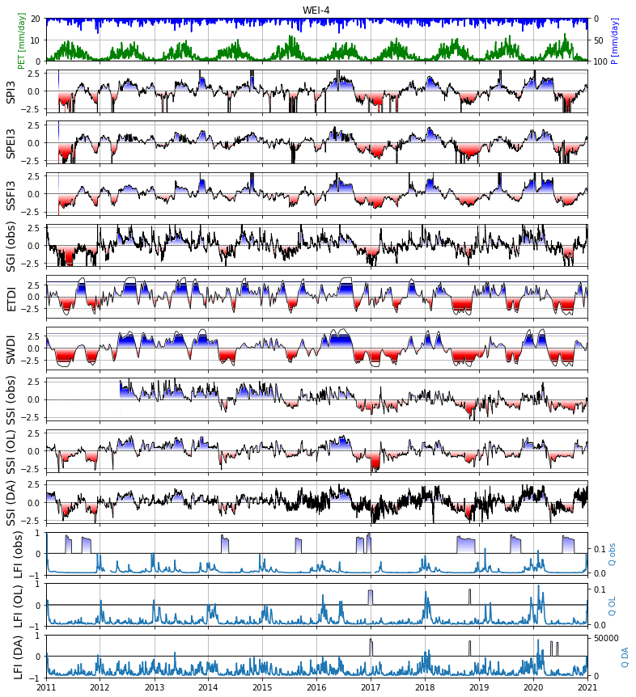

# G4GRASS
Github for GRASS (drought in Luxembourg and the Greater Region)

## A. Presentation of the hydrologic model

### A.1. SUPERFLEX model version history

<table border=0 cellpadding=0 cellspacing=0 width=1193 style='border-collapse:
 collapse;table-layout:fixed;width:895pt;mso-yfti-tbllook:1056'>
 <col width=235 style='mso-width-source:userset;mso-width-alt:8594;width:176pt'>
 <col width=200 style='mso-width-source:userset;mso-width-alt:4681;width:96pt'>
 <col width=257 style='mso-width-source:userset;mso-width-alt:9398;width:193pt'>
 <col width=157 style='mso-width-source:userset;mso-width-alt:5741;width:118pt'>
 <col width=416 style='mso-width-source:userset;mso-width-alt:15213;width:312pt'>
 <tr height=20 style='height:15.0pt'>
  <td height=20 width=235 style='height:15.0pt;width:176pt'></td>
  <td width=200 style='width:96pt'>Model extent</td>
  <td width=257 style='width:193pt'>Resolution / Timestep</td>
  <td width=157 style='width:118pt'>Number of parameters</td>
  <td width=416 style='width:312pt'>Notes</td>
 </tr>
 <tr height=20 style='height:15.0pt'>
  <td height=20 style='height:15.0pt'>CRAKE+GRASS</td>
  <td>Greater Region</td>
  <td>1km / Hourly</td>
  <td>8</td>
  <td rowspan=3 class=xl66 width=416 style='width:312pt'>- ERA5 P and PET 
    - 5 land-use classes, 2 geology classes 
    - 4 reservoirs (2 UR, 1 FR, 1 SR) 
    - S1max = 5cm, S2max = 95 cm (fixed) 
    - Calibration over discharge (4 stations) and S1 SM data
 
 </td>
 </tr>
 <tr height=20 style='height:15.0pt'>
  <td height=20 style='height:15.0pt'>GRASS</td>
  <td>Greater Region</td>
  <td rowspan=3 class=xl65>1km / Daily (timelag functions not used)</td>
  <td>9 (added Field capacity)</td>
 </tr>
 <tr height=20 style='height:15.0pt'>
  <td height=20 style='height:15.0pt'>GRASS (currently used for testing DA)</td>
  <td>Alzette sub-catchment</td>
  <td>9</td>
 </tr>
 <tr height=20 style='height:15.0pt'>
  <td height=20 style='height:15.0pt'>GRASS updated (TBD)</td>
  <td>Greater Region</td>
  <td>9</td>
  <td>Updating equations… + recalibration</td>
 </tr>
 <![if supportMisalignedColumns]>
 <![endif]>
</table>

### A.2. DA development version history

<table border=0 cellpadding=0 cellspacing=0 width=1159 style='border-collapse:
 collapse;table-layout:fixed;width:869pt;mso-yfti-tbllook:1056'>
 <col width=235 style='mso-width-source:userset;mso-width-alt:8594;width:176pt'>
 <col width=128 style='mso-width-source:userset;mso-width-alt:4681;width:96pt'>
 <col width=200 style='mso-width-source:userset;mso-width-alt:9398;width:193pt'>
 <col width=300 style='mso-width-source:userset;mso-width-alt:10971;width:225pt'>
 <col width=239 style='mso-width-source:userset;mso-width-alt:8740;width:179pt'>
 <tr height=20 style='height:15.0pt'>
  <td height=20 style='height:15.0pt'></td>
  <td class=xl68>Assimilation time</td>
  <td class=xl68>Observations</td>
  <td class=xl68>Control vector</td>
  <td class=xl68>Perturbation</td>
 </tr>
 <tr height=40 style='height:30.0pt'>
  <td height=40 style='height:30.0pt'>DA (first iteration)</td>
  <td>Monthly</td>
  <td>Q (in-situ)</td>
  <td>5 state vars</td>
  <td class=xl66 width=239 style='width:179pt'>- Gaussian, additive for P and PET.  
    - 10 members</td>
 </tr>
 <tr height=40 style='height:30.0pt'>
  <td height=40 style='height:30.0pt'>DA (Nth iteration)</td>
  <td>Daily</td>
  <td class=xl66 width=257 style='width:193pt'>Q (in-situ) 
    SM (in-situ)</td>
  <td>5 state vars at all cells from the sub-catchment</td>
  <td rowspan=3 class=xl67 width=239 style='width:179pt'>- Log-normal,
  multiplicative for P 
    - Gaussian, additive for PET 
    - 10-50 members</td>
 </tr>
 <tr height=40 style='height:30.0pt'>
  <td height=40 style='height:30.0pt'>DA (Nth iteration)</td>
  <td>Daily</td>
  <td class=xl66 width=257 style='width:193pt'>Q (in-situ) 
    SM (in-situ)</td>
  <td>5 state vars + 1 param (&#961;)</td>
 </tr>
 <tr height=40 style='height:30.0pt'>
  <td height=40 style='height:30.0pt'>DA (last iteration)</td>
  <td>Daily</td>
  <td class=xl66 width=257 style='width:193pt'>SM (satellite) 
    GRACE</td>
  <td>5 state vars at all cells from the sub-catchment</td>
 </tr>
 <![if supportMisalignedColumns]>
 <![endif]>
</table>

## C. CCCC

## D. Drought Indices

<table border=0 cellpadding=0 cellspacing=0 width=2099 style='border-collapse:
 collapse;table-layout:fixed;width:1576pt;mso-yfti-tbllook:1056'>
 <col width=234 style='mso-width-source:userset;mso-width-alt:8557;width:176pt'>
 <col width=303 style='mso-width-source:userset;mso-width-alt:11081;width:227pt'>
 <col width=130 style='mso-width-source:userset;mso-width-alt:4754;width:98pt'>
 <col width=193 style='mso-width-source:userset;mso-width-alt:7058;width:145pt'>
 <col width=129 style='mso-width-source:userset;mso-width-alt:4717;width:97pt'>
 <col width=1110 style='mso-width-source:userset;mso-width-alt:40594;
 width:833pt'>
 <tr height=20 style='height:15.0pt'>
  <td height=20 class=xl65 width=234 style='height:15.0pt;width:176pt'>class</td>
  <td class=xl65 width=303 style='width:227pt'>Index</td>
  <td class=xl65 width=130 style='width:98pt'>Input</td>
  <td class=xl65 width=193 style='width:145pt'>Spatial availability</td>
  <td class=xl65 width=129 style='width:97pt'>Time</td>
  <td class=xl65 width=1110 style='width:833pt'>Reference</td>
 </tr>
 <tr height=22 style='height:16.5pt'>
  <td rowspan=3 height=66 class=xl69 style='height:49.5pt'>Meteorological
  droughts</td>
  <td>SPI (1, 3, 6, 9, 12)</td>
  <td>P</td>
  <td>0.25o x 0.25o (ERA5)</td>
  <td>1, 3, 6, 9, 12 months</td>
  <td class=xl70>LLoyd-Hughes, B. and Saunders, M.A.: A drought climatology for
  Europe. International Journal of Climatology, 22, 1571-1592, 2002.</td>
 </tr>
 <tr height=22 style='height:16.5pt'>
  <td height=22 style='height:16.5pt'>SPEI (1, 3, 6, 9, 12)</td>
  <td>P, PET</td>
  <td>0.25o x 0.25o (ERA5)</td>
  <td>1, 3, 6, 9, 12 months</td>
  <td class=xl70>Vicente-Serrano S.M., Beguería S., López-Moreno J.I.: A
  Multi-scalar drought index sensitive to global warming: The Standardized
  Precipitation Evapotranspiration Index. Journal of Climate, 23, 1696-1718,
  2010.</td>
 </tr>
 <tr height=22 style='height:16.5pt'>
  <td height=22 style='height:16.5pt'>SSFI (1, 3, 6, 9, 12)</td>
  <td>P</td>
  <td>0.25o x 0.25o (ERA5)</td>
  <td>1, 3, 6, 9, 12 months</td>
  <td class=xl70>Tijdeman, E., Stahl, K., &amp; Tallaksen, L. M.: Drought
  characteristics derived based on the Standardized Streamflow Index: A large
  sample comparison for parametric and nonparametric methods. Water Resources
  Research, 56, 2020.</td>
 </tr>
 <tr height=20 style='height:15.0pt'>
  <td height=20 style='height:15.0pt'>Groundwater</td>
  <td>SGI - Standardized Groundwater Index</td>
  <td>Groundwater heads</td>
  <td>In-situ GW stations</td>
  <td>Hourly</td>
  <td class=xl70>Bloomfield, J. P. and Marchant, B. P.: Analysis of groundwater
  drought building on the standardised precipitation index approach. Hydrol.
  Earth Syst. Sci., 17, 4769–4787, 2013.</td>
 </tr>
 <tr height=20 style='height:15.0pt'>
  <td rowspan=4 height=80 class=xl69 style='height:60.0pt'>Soil moisture /
  Agricultural droughts</td>
  <td>ETDI (weekly) - Evapotranspiration Deficit Index</td>
  <td>PET, AET</td>
  <td>Cell 1km x 1km</td>
  <td>Weekly</td>
  <td rowspan=2 class=xl71>Narasimhan, B., and R. Srinivasan. &quot;Development
  and evaluation of Soil Moisture Deficit Index (SMDI) and Evapotranspiration
  Deficit Index (ETDI) for agricultural drought monitoring.&quot; Agricultural
  and forest meteorology 133, no. 1-4 (2005): 69-88.</td>
 </tr>
 <tr height=20 style='height:15.0pt'>
  <td height=20 style='height:15.0pt'>SWDI (weekly, 1m) - Soil Water Deficit
  Index</td>
  <td>Water content (S)</td>
  <td>Cell 1km x 1km</td>
  <td>Weekly</td>
 </tr>
 <tr height=20 style='height:15.0pt'>
  <td rowspan=2 height=40 class=xl69 style='height:30.0pt'>SSI - Standardized
  Soil moisture Index</td>
  <td>Soil moisture (&#952;)</td>
  <td>In-situ SM stations</td>
  <td>Hourly</td>
  <td rowspan=2 class=xl71>AghaKouchak, A. &quot;A baseline probabilistic
  drought forecasting framework using standardized soil moisture index:
  application to the 2012 United States drought.&quot; Hydrology and Earth
  System Sciences 18, no. 7 (2014): 2485-2492.</td>
 </tr>
 <tr height=20 style='height:15.0pt'>
  <td height=20 style='height:15.0pt'>Soil moisture (&#952;)</td>
  <td>Cell 1km x 1km</td>
  <td>Daily</td>
 </tr>
 <tr height=20 style='height:15.0pt'>
  <td rowspan=2 height=40 class=xl69 style='height:30.0pt'>Hydrological
  droughts</td>
  <td rowspan=2 class=xl69>LFI (Q95, 10 days) - Low-Flow Index</td>
  <td rowspan=2 class=xl69>Discharge (Q)</td>
  <td>In-situ Q stations</td>
  <td>Monthly</td>
  <td rowspan=2 class=xl71>Cammalleri, Carmelo, Jürgen Vogt, and Peter Salamon.
  &quot;Development of an operational low-flow index for hydrological drought
  monitoring over Europe.&quot; Hydrological Sciences Journal 62, no. 3 (2017):
  346-358.</td>
 </tr>
 <tr height=20 style='height:15.0pt'>
  <td height=20 style='height:15.0pt'>Cell 1km x 1km</td>
  <td>Monthly</td>
 </tr>
 <![if supportMisalignedColumns]>
 <![endif]>
</table>

